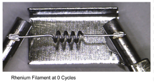
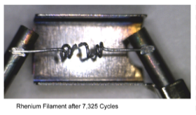
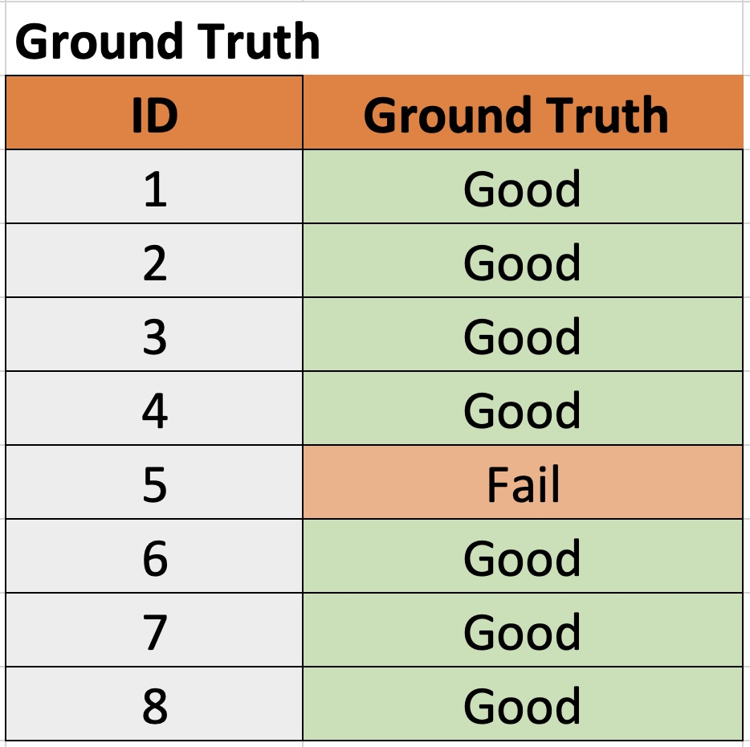
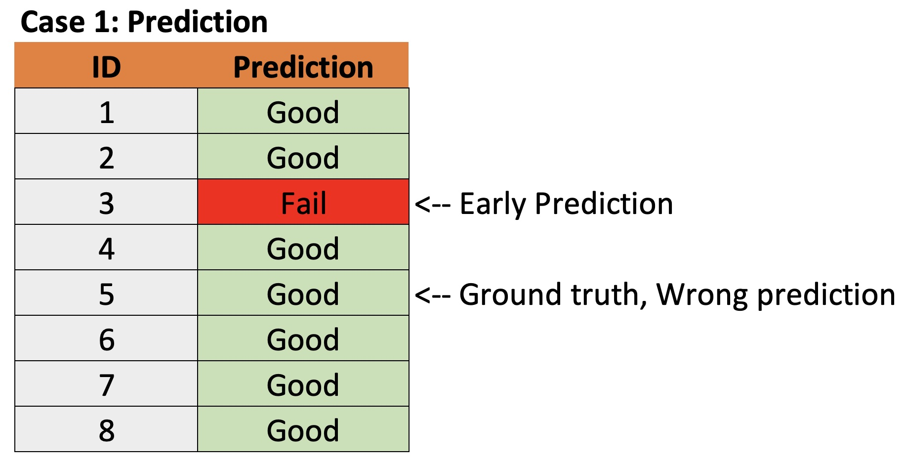
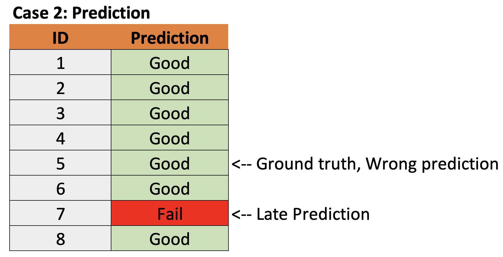

# UTS Tech Festival 2023: AI Hackathon

## Date, Time, Location

* <b>Date, Time:</b> Mon 19th Jun 2023, 10:00 am - Tue 20th Jun 2023, 6:00 pm AEST
* <b>Location:</b>  UTS Building 7 (Vicki Sara Building), Level 3, Room 10B and 10G, 67 Thomas St, Ultimo NSW 2007, Australia

## Schedule

**DAY-1: June 19, 2023**
* 10:00 am : Opening
* 10:15 am : Information Session, introduction to the challenge
* 11:00 am : Train and Validation dataset released
* 11:05 am : Hackathon start!
* 11:30 am : Organizing team available for Q&A and assistance to the participanting teams
* 12:30 pm : Lunch
* 04:00 pm : Afternoon tea
* 05.30 pm : Day-1 Concludes, teams to continue hacking

**DAY-2: June 20, 2023**
* 10:00 am : Teams to continue hacking!
* 12:30 am : Lunch
* 01:00 pm : Teams to start finalizing their submission
* 02:00 pm : Test dataset released for testing solution and preparing submission, Final Submission portal openned 
* 03:00 pm : Submission portal closed
* 03:10 pm : Evaluation starts
* 03:30 pm : Afternoon tea
* 04:00 pm : Leader board released, Top-5 entries selected for final pitch
* 04:15 pm : Pitch begins (5mins for each selected teams)
* 05:00 pm : Pitch presentation conclude
* 05:30 pm : Hackathon winners announced! 

## Team Registration

Team registration is essential. Please use the link to the Google Form below to register your team.

**Maximun members in team :** 3

## LeaderBoard

Click the button below to access the AU Hackathon LeaderBoard:

## Submission 

Click the button below to make submission (Will be available on Day-2)

## Background

One of the most common tools environmental labs use to analyse samples is a piece of equipment called a Gas Chromatograph Mass Spectrometer (GC-MS). This equipment can be divided into two sections; the gas chromatograph (GC) and the mass spectrometer (MS). The GC is used to process the sample and deliver it to the MS. The MS is used to detect and measure environmental contaminants in the samples. This project will be focusing on the MS.

The MS has three main sections that perform different roles. These are the source, the mass filter, and the detector. The source has a pair of filaments, where one acts to emit a beam of electrons and the other acts of an electron trap to receive the electrons. The sample is introduced to the source and the molecules of interest encounter the electron beam. The electron beam removes an electron from the molecule, causing it to become ionised and have a positive charge. The positively charged molecule is then pushed out of the ion source using a positive charged plate called a repeller. The ion is then focused using a series of lenses which are held at different voltages before it is passes into the mass filter.

Different molecules have different masses depending on the number of carbon, hydrogen, and other atoms in its structure. For example, benzene (a common environmental contaminant) has a molecular mass of 78, while toluene (another contaminant) has a molecular mass of 92. The role of the mass filter is to distinguish the mass of the ions by only allowing one mass to reach the detector at a time. This is performed by applying certain voltages to a set of four parallel rods. Depending on the voltages, a certain mass will be able to pass through and reach the detector.

The role of the detector is to measure how many ions of each mass pass through the mass filter. The signal determined by the detector is then used to measure how much of each contaminant is present in the sample.

  
## A look at the problem
  
As the MS analyses samples, the filaments used to generate the electron beam in the source begin to wear. Eventually the filament breaks, which prevents it from being able to generate an electron beam. When this occurs, the MS is unable to analyse samples. See an example below of a new filament and one that has failed in Figure 1. As there are two filaments, when one fails, the MS can switch to the second before analysing more samples. However, when both filaments have failed, the filaments must be replaced before the MS can operate again.

  

  
  
Filament failures are extremely disruptive to the laboratory’s operations. When a filament fails overnight, it can delay up to 12 hours of analysis time for samples. Additionally, when both filaments need to be replaced it takes at least 4 hours to replace them. This leads to delays in reporting results to our clients who are often working to strict deadlines.
  
Our current solution to this issue is to estimate the filament lifetime to 45 days. This is usually effective in preventing unexpected filament failure. However, the downside to this approach is that we often change filaments before their useful lifetime. This leads to more frequent MS downtime due to replacing the filaments, increased costs and increased waste generated by the laboratory.
  
The aim of this hackathon is to generate AI tools the laboratory can use to predict when each filament is about to fail. The most effective tool will be judged by how close it can predict the filament failure before but not after the failure. This will allow the laboratory to deliver a reliable and timely service to our clients while minimising costs and waste.
  
To help you develop your AI tool we will be providing you with real data from our laboratory. As the MS analyses samples, its performance degrades requiring the adjustment of certain parameters which is performed during a “tune”. Just like tuning a guitar to ensure it produces the correct sound, tuning of the MS ensures that it is producing the correct output. After a tune is performed, a report is generated by the MS detailing various parameters of the system. The files we have provided you detail the parameters of different MS’s in our laboratory leading up to and right before filament failures. This is the data you will use to develop your AI model.
  
There is not a parameter from the tune report that is directly diagnostic of an approaching filament failure to our knowledge. In general, higher numbers of samples and highly contaminated samples will cause the filament to fail earlier. However, this information is not stored by the software and can be difficult to track.
  
The ‘good news’ is that the quantity and nature of the samples also affects the performance of our source, requiring the adjustment of the various parameters, sometimes in a predictable way. This change in source condition is captured by the tune values which are presented to you in the data set. Therefore, there may be a correlation between certain tune parameters and filament failure which can be used to develop an AI solution.
  
  
## Understanding the parameters

Here we will provide additional detail on each of the parameters so you can understand their importance to the MS operation.

### Generic values
* **Tune Date** : this is the date and time when each MS tune was performed.
* **System** : We have several MS’s in our laboratory. This is the ID of the MS the tune data is from.
  
### Source values
A diagram of a MS source is below. In the diagram you can see a filament that is being used to emit electrons (e-) to an electron trap electrode. The electron trap electrode is also a filament but is instead being used to collect the electron beam instead of generating it. After the first filament breaks, the roles of the filaments can be swapped, so that the previous electron emitter becomes the collector, and the previous collector becomes the emitter. 
* **Filament** – Designates which filament is being used as the electron emitter. When the filament value switches from 1 to 2, that means that the first filament has failed after the last recorded tune for filament 1 and the second filament has now been designated the emitter. The end of the csv indicates that the second filament has also failed after the last recorded tune for filament 2.
Once the neutral analyte (blue) interacts with an electron, it becomes a positively charged molecular ion (green). These molecular ions (green) can also break apart and form fragment ions (red). Note this for later. The mass analyser is perpendicular to the electron beam, so the ions must be pushed in that direction to be analysed and detected. This is done through a repeller which is held at a positive charge. The positive ions will be repulsed by the positive repeller towards the mass filter.
* **Repeller** – The value is the voltage of the repeller after tuning the MS.
After being repelled towards the mass filter, the ions need to be focused into a narrow beam to be further processed by the MS effectively. This is performed by the ion focus lens which is held at a positive voltage
* **Ion Focus Lens** - This value is the voltage of the ion focus lens after tuning the MS.
The mass filter which will be discussed later gives of fringing fields which can affect the ions in the source. To protect against these fringing fields, the source has an entrance lens which is also held at a positive voltage. There are two components to entrance lens in the tune. The first is the entrance lens offset. This is used to calculate the entrance lens voltage in combination with other variables such that entrance lens voltage = entrance lens offset + other variables.
Entrance lens offset – This value is used in the calculation of the entrance lens voltage.
* **Entrance lens** - This value is the voltage of the entrance lens calculated using the entrance lens offset value after tuning the MS.
Finally, the source is maintained at a certain temperature depending on the analysis it performs. Each system will be maintained at a single temperature but there may be a difference in values between systems depending on the test.
* **Temp** – temperature of the source in °C of the source.
  
  

*Figure 2: Diagram of a mass spectrometer source illustrating how it operates.* 

  
### Mass Filter Values
The mass filter consists of four parallel rods as shown in the image below. To the top and bottom rods, a positive DC voltage and an RF voltage are simultaneously applied. To the left and right rods, the same DC and RF voltage are applied but the opposite sign. The voltages applied to these four rods causes ions to spiral as they pass through the mass filter. 

  

*Figure 3: Illustration of the DC and RF voltage applied to the four rods of the mass filter.* 

  
Under given DC and RF voltages only a single mass ion will exhibit a stable spiral trajectory through the rods and reach the detector to be measured. Ions with different masses will exhibit an unstable trajectory and ultimately not reach the detector or be measured.

*Figure 4: Illustration of two ions travelling through the mass filter. The DC and RF voltages of the four rods are at values that allow the mass of the red ion to pass through to the detector. However, the blue ion which has a different mass has an unstable trajectory and does not reach the detector.*
  
As part of the tune, the MS determines the “mass scan line” which is the relationship between the DC and RF voltage applied to the rods to detect each mass. The slope and intercept of this mass scan line is reported under “Amu gain” and “Amu offset”.
* **Amu gain** – the slope of the mass scan line
* **Amu offset** – the intercept of the mass scan line
In reality, the mass scan line is not perfectly linear. This requires a correction in the middle of the mass can line called “Width219”. For illustration purposes this would be performed at m2 in Figure 5.
* **Width219** – correction applied to mass scan line

  

*Figure 5: Illutration of how the mass can line is calculated using the signals at different masses.*

### Detector Parameters
The detector of the MS is a high energy conversion dynode (HED) coupled to an electron multiplier (EM). After passing through the mass filter, the ion hits the HED electrons are emitted which are attracted to the more positive voltage of the EM.
Electrons liberated from the HED cascade through the EM, liberating more electrons as they go. This effectively acts as a ‘gain’ for the signal. The higher the value of the voltage, the more electrons get liberated and the higher the gain.
EM Volts – This value is the voltage of the EM after tuning the MS.

### Tuning Compound
At the heart of the MS tune is a tuning compound called PFTBA. This compound is introduced to the MS for the purpose of the tune. Remember how we mentioned that compounds can fragment in the source? Well, PFTBA has three main fragments which we use for our tune which are 69, 219 and 502. 
  
All the tuning parameters discussed earlier are determined using the PFTBA fragmentation to maximise the signal of the 69, 219 and 502 masses.
* 69 m/z – signal of the 69 fragment of PFTBA after tuning
* 219 m/z – signal of the 219 fragment of PFTBA after tuning
* 502 m/z – signal of the 502 fragment of PFTBA after tuning
There are also other smaller fragments we monitor in our tune, these are 70, 220 and 503. 
* 70 m/z – signal of the 69 fragment of PFTBA after tuning
* 220 m/z – signal of the 220 fragment of PFTBA after tuning
* 503 m/z – signal of the 503 fragment of PFTBA after tuning

### What we think might help
Some of the key values we look at to assess the source condition are below.
* **EM Volts** – this tends to trend towards higher values with source use. Each system will usually have a different starting voltage for a new source and filaments.
* **502 m/z to 69 m/z ratio** - this tends to trend towards higher values with source use. Each system will usually have a different starting ratio for a new source and filaments.
You will notice that each MS will have different values for many of the parameters, EM Volts being a good example. Another tip we’d give is that it is sometimes more important to look at the change in value with time as opposed to the actual value.

## Evaluation Metrics

A custom metric will be used for evaluation of the submissions. Customized **Time Weighted F1 score** has been designed to score the submissions, with following characteristics:

* **Early Prediction Penalty**: Penalties are applied when the filament failure is predicted much earlier than actual failure, to minimize the cost of replacing the filament too early, and optimize it use.
* **Late Prediction Penalty**: Heavy Penalties are applied when the filament failure is prediected after the actual failure, and increases exponentially based on the amount (tuning iteration) of delay. This is required to protect the system from additional damage or complete failure.

**Example Cases for illustration:**

## Submission Process

Submission link will be available 1 hours prior to the end of the Hackathon along with the test dataset. 
Participants need to run their solution on the provided test dataset and produce a test.csv for submission via Google Form. The entries will be evaluation on real-time and the performance will be shared via email and will be available on the Leader-Board.

**List of items required for submission:**
* test.csv
* Code file(s)
* Instruction steps to reproduce results (including any pre-processing steps used. (e.g. Readme file)
* Trained  model file (if any)

## Finalize Hackathon Winner
* Top 5 entries on the Leader-board will be invited pitch their solution (ppt, live demos of code etc. can be used) : 5 mins pitch
* Selected entries to highlight the following:
  - Performance
  - AI/ML technique used and why
  - Identified attributes which are more relevant to accurately predict the filament failure.
